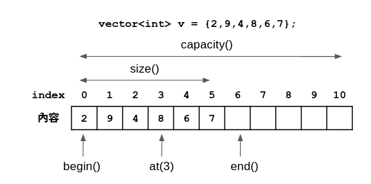

# Leecode Solution
|Degree|Title|Time Complexity|Space Conplexity|
|:-:|:-:|:-:|:-:|
|Easy|Two Sum||

[Leecode Link](https://leetcode.com/)[target =_blank]
## Vector 
vector 底層實現是一個連續記憶體空間，當容量不夠的時候就會重新申請空間，並把原本資料複製或搬移到新的空間。  

vector 的容器大小可以動態增長，但是並不意味著每一次插入操作都進行 reallocate。記憶體的分配與釋放耗費的資源是比較大的，因此應該減少它的次數。這也就意味著容器的容量(capacity)與容器目前容納的大小(size)是不等的，前者應大於後者。  

vector 分配新的空間時，容量(capacity)可能為原有容量的 2 倍或者原有容量的 1.5 倍，各個編譯器可能不同，稍後會介紹。  

